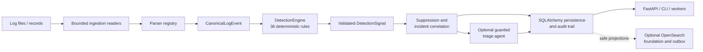

# Agentic SOC Triage Assistant

[](https://github.com/beratkrmn7/Agentic-SOC-Triage-Assistant/actions/workflows/ci.yml)
[](https://www.python.org/downloads/)

A deterministic, evidence-first security operations triage platform with an optional,
constrained LLM review stage.

The project ingests heterogeneous logs, normalizes them into a canonical event model,
evaluates 36 registered detection rules, correlates valid signals into incidents, and can
then ask a guarded triage agent to prepare an analyst-facing report. Ingestion and
detection do not call an LLM or any other provider; provider access is confined to the
optional triage stage.

> [!IMPORTANT]
> This system is an analyst-support tool. It does not autonomously block traffic, change
> firewall policy, or prove exploitation, authentication, or compromise from an allowed
> connection alone.

## What the project provides

- **Deterministic ingestion:** bounded streaming readers for JSON Lines, JSON arrays,
  single JSON objects, Syslog, CEF, and supported text logs.
- **Canonical normalization:** stable `EVT-*` identifiers, timezone-aware timestamps,
  parse status, network/NAT/zone fields, PF SPI metadata, and structural TCP flags.
- **Contract-driven detection:** immutable rule metadata, deterministic registration,
  rule-level event eligibility, signal validation, and evidence ownership checks.
- **36 default rules:** network scanning, service probing, TCP/SPI anomalies, firewall
  exposure, and firewall policy behavior.
- **Deterministic correlation:** stable signal and incident identities, bounded evidence,
  overlapping-window deduplication, optional cross-job campaign continuity, and transparent
  provenance.
- **SOC-focused output:** a concise provider-free brief groups compatible blocked
  reconnaissance, prioritizes actionable exposure, lists suppressed findings, and inventories
  exposed assets without changing canonical incidents.
- **Secure optional triage:** Groq or local Ollama provider support, bounded tools,
  evidence and claim validation, retries, circuit breaking, caching, and safe
  `needs_review` fallbacks.
- **Persistent application layer:** SQLAlchemy repositories, Unit of Work transactions,
  Alembic migrations, incident lifecycle state, audit trails, and idempotent analysis jobs.
- **REST and worker interfaces:** FastAPI endpoints, database-backed polling workers, and
  an optional Celery/Redis queue adapter.
- **Operational controls:** API key or OIDC/JWT authentication, RBAC, rate limiting,
  request-size limits, security headers, structured database search, retention planning,
  verified archives, bounded cleanup, and an optional OpenSearch foundation.

## Architecture



The important trust boundary is between deterministic analysis and agentic review:

1. Readers and parsers produce validated canonical events.
2. `DetectionEngine` performs global eligibility and deduplication checks.
3. Each registered rule selects relevant events through its metadata contract.
4. Every emitted signal is checked against rule identity, input event IDs, evidence
   ownership, ordering, severity, and duplicate constraints.
5. Valid signals are correlated into deterministic incident bundles.
6. If enabled, the triage agent receives structured incident context and bounded tools;
   its evidence and claims are verified before a report is accepted.

Run `python main.py --detect-file ...` or call `/detect/file` when a completely
provider-free path is required.

## End-to-end analysis workflow

Every entry point — CLI detect/analyze, synchronous API requests, and background
analysis workers — shares one `AnalysisService` persistence flow, in this fixed order:

1. **Log ingestion.** Bounded readers load records safely from a file.
2. **Parsing and semantic validation.** The parser registry normalizes records into
   `CanonicalLogEvent`s and drops malformed or semantically invalid records.
3. **Deterministic detection.** All semantically valid events are evaluated by the 36
   default rules; every emitted signal is contract-validated.
4. **Batch correlation.** Valid signals are correlated into batch-local incident bundles.
5. **Optional persistent cross-job correlation.** When
   `STATEFUL_CORRELATION_ENABLED=true`, batch incidents are resolved against previously
   persisted incidents so activity from the same campaign across adjacent files converges
   on one canonical incident. Absorbed duplicates are never persisted, reported, returned,
   or projected. This is controlled by a feature flag and **remains disabled by default**
   until final real-log validation. When off, the batch-local path runs unchanged and
   `IncidentCorrelationState` is never read or written.
6. **Deterministic triage routing.** Each unique final incident is routed exactly once —
   `individual_triage`, `deterministic_report`, `digest`, or `store_only`.
7. **LLM only for actionable incidents.** Only `individual_triage` incidents reach the
   provider, at most once per unique final incident per job. The other three routes make
   zero provider calls.
8. **Concise SOC report.** `--report brief` renders deterministic rollups and already
   available report results; it does not create a second provider path. `--report full`
   preserves the per-incident panels. A firewall allow does not prove access, transport
   activity does not prove compromise, and deterministic incident identity cannot be
   renamed by the model.
9. **Persistence and API/CLI output.** Events, signals, canonical incidents, reports, and
   audit events are committed in one transaction, with final projections enqueued through
   the transactional outbox. Any unexpected failure rolls back the entire job.

Guarantees worth stating explicitly:

- Detection is fully deterministic.
- Ingestion and detection make **zero** LLM calls under any condition.
- Only individual-triage incidents reach the LLM.
- `deterministic_report`, `digest`, `store_only`, completed-job replay, and brief rendering
  make **zero** provider calls.
- A fresh job makes at most one provider call per unique final canonical incident.
- Persistent cross-job correlation is controlled by a feature flag whose default is off.
- No automated containment or firewall changes are ever performed.

## Detection coverage

The default registry contains exactly **36 rules**, ordered by ascending priority and then
by `rule_id`. Calling default registration repeatedly is idempotent.

| Pack | Count | Registered rule IDs |
| --- | ---: | --- |
| Correctness and contract foundation | 5 | `network_scan_horizontal`, `network_scan_vertical`, `remote_service_probe`, `spi_anomaly_burst`, `network_flood_dos` |
| Advanced scan pack | 8 | `low_and_slow_horizontal_scan`, `low_and_slow_vertical_scan`, `repeated_blocked_scanner`, `internal_lateral_scan`, `subnet_sweep`, `distributed_scan`, `multi_service_sweep`, `scan_followed_by_allowed_connection` |
| Remote service probe pack | 8 | `smb_probe`, `vnc_probe`, `winrm_probe`, `database_service_probe`, `kubernetes_service_probe`, `docker_daemon_probe`, `web_admin_panel_probe`, `legacy_cleartext_service_probe` |
| TCP and SPI anomaly pack | 8 | `tcp_null_scan`, `tcp_xmas_scan`, `tcp_fin_scan`, `tcp_ack_scan`, `tcp_syn_fin_anomaly`, `tcp_syn_rst_anomaly`, `repeated_tcp_reset_anomaly`, `spi_followed_by_allowed_connection` |
| Inbound exposure and policy pack | 7 | `inbound_sensitive_service_allowed`, `critical_management_service_exposed`, `dnat_sensitive_service_exposure`, `wan_to_lan_sensitive_service_allowed`, `wan_to_dmz_administrative_service_allowed`, `blocked_then_allowed_same_service`, `multi_source_allowed_sensitive_service` |

`remote_service_probe` remains one registered rule while preserving the historical
service-specific RDP and SSH signal identities (`rdp_probe` and `ssh_probe`) through
validated signal variants.

The inbound exposure pack uses translated destination fields when present without
mutating the canonical event. It recognizes bounded, case-insensitive WAN/LAN/DMZ zone
tokens, excludes ordinary ports 80 and 443, and treats an allowed event only as policy or
exposure evidence—not proof of compromise. The narrow single-event critical management
set is SNMP (161), IPMI/BMC (623), Docker plaintext daemon (2375), WinRM HTTP
(5985), Redis (6379), Elasticsearch (9200), Kubelet (10250), Memcached (11211),
and MongoDB (27017). The broader sensitive set also covers FTP data/control, SSH,
Telnet, MSRPC, NetBIOS/SMB, LDAP, MSSQL, MySQL, RDP, PostgreSQL, and VNC.

## Incident and report semantics

The canonical incident remains the source of truth. Presentation rollups never alter
detection, persistence, routing, incident identity, or API output.

- Exposure and firewall-policy incidents use the effective destination asset as
  `primary_entity`; scan and service-probe incidents use the observed source. Titles
  independently render `from <source IP>`.
- Effective destination means `translated_dst_ip`/`translated_dst_port` when present,
  otherwise the original destination. Canonical events are never overwritten.
- Explicit NAT, translated addresses, zones, interfaces, TCP flags, action reason,
  bounded FQDNs, traffic volume, and an allowlisted parser-metadata subset survive the
  database round trip.
- Fully blocked scan/probe activity is severity-capped by family-aware policy; allowed
  sensitive or critical exposure outranks blocked reconnaissance. Severity does not claim
  asset business criticality or successful compromise.
- Nested or strongly overlapping incidents with the same identity are merged
  deterministically. Evidence remains bounded and belongs to the final event set.
- A structural late-RST SPI sequence of at least two events is suppressed only when its canonical event facts
  satisfy the exact service-source, ephemeral-destination, reset-flag, destination, and
  action constraints. Suppression is visible in the brief.
- Blocked reconnaissance is grouped only when every contributing incident is blocked and
  family, service/port scope, and time are compatible. Mixed or allowed traffic stays in
  an actionable or investigation section; a shared `/24` alone is never sufficient.

See [Detection Engine](docs/detection_engine.md) for rule contracts, thresholds, service
sets, event eligibility, evidence requirements, and instructions for adding a rule.

## Supported parsing and normalization

The parser registry selects the best deterministic parser by confidence and validates its
output before it can reach detection. Current parsers cover:

- PF firewall logs (`PfFirewallParser` version 2.2.0), including NAT fields, interface
  zones, SPI indicators, and normalized TCP flags;
- CEF records;
- RFC-style Syslog records;
- generic JSON records;
- deterministic mock/test records.

Malformed or unsupported records are isolated and counted rather than crashing the
whole file. Successfully parsed and semantically valid events remain eligible for global
detection even when an earlier filtering role would not classify them as triage
candidates.

To add another parser, follow [Adding a Parser](docs/adding-a-parser.md).

## Quick start

### Requirements

- Python 3.11 or newer
- Git
- A Groq API key only if Groq-backed triage is enabled
- Ollama only if local Ollama-backed triage is enabled
- Redis only when using Celery or the Redis rate-limit backend
- OpenSearch only when its optional foundation is explicitly enabled

### Install on Windows PowerShell

```powershell
git clone https://github.com/beratkrmn7/Agentic-SOC-Triage-Assistant.git
Set-Location Agentic-SOC-Triage-Assistant

py -3.11 -m venv .venv
.\.venv\Scripts\Activate.ps1
python -m pip install --upgrade pip
python -m pip install -r requirements-dev.txt

Copy-Item .env.example .env
python -m alembic upgrade head
```

### Install on Linux or macOS

```bash
git clone https://github.com/beratkrmn7/Agentic-SOC-Triage-Assistant.git
cd Agentic-SOC-Triage-Assistant

python3.11 -m venv .venv
source .venv/bin/activate
python -m pip install --upgrade pip
python -m pip install -r requirements-dev.txt

cp .env.example .env
python -m alembic upgrade head
```

SQLite is the default database (`sqlite:///soc_triage.db`). Alembic should be upgraded
before using the persistent API or background workers.

## Configuration

Settings are loaded from environment variables and `.env` through Pydantic Settings.
Start with [.env.example](.env.example); it documents the available security, triage,
rate-limit, search, retention, and OpenSearch options.

| Setting | Default | Purpose |
| --- | --- | --- |
| `LLM_ENABLED` | `true` | Enables the optional triage stage; it does not affect pure detection mode. |
| `LLM_PROVIDER` | `groq` | Selects `groq` or `ollama`. |
| `GROQ_API_KEY` | empty | Required only for Groq-backed triage. |
| `DATABASE_URL` | `sqlite:///soc_triage.db` | SQLAlchemy database connection. |
| `AUTH_MODE` | `disabled` | Local bypass, `api_key`, `oidc`, or `hybrid`. |
| `TASK_QUEUE_BACKEND` | `database` | Database polling or `celery`. |
| `STAGING_DIR` | `/tmp/agent_staging` | Shared bounded upload staging directory. |
| `RATE_LIMIT_BACKEND` | `memory` | Development memory limiter or production Redis limiter. |
| `OPENSEARCH_ENABLED` | `false` | Enables explicit OpenSearch maintenance operations. |
| `STATEFUL_CORRELATION_ENABLED` | `false` | Enables optional persistent cross-job incident correlation. Default off until final real-log validation; when off, behavior, incident IDs, and provider-call counts are exactly the batch-local path. |

For a provider-free local configuration, set:

```dotenv
LLM_ENABLED=false
LLM_PARSER_FALLBACK_ENABLED=false
```

Production configuration is intentionally fail-closed. Replace all example secrets,
enable HTTPS, configure trusted hosts/proxies explicitly, use durable shared rate
limiting, and select an authenticated `AUTH_MODE` before exposing the API.

## Command-line usage

### Ingestion only

```bash
python main.py --ingest-file data/samples/sanitized_firewall_sample.jsonl
```

This prints format, parser, duration, success/failure, and safe warning counts.

### Deterministic detection only

```bash
python main.py --detect-file data/samples/sanitized_firewall_sample.jsonl
```

This runs ingestion, all 36 default detection rules, suppression, and incident
correlation without invoking a provider.

### End-to-end analysis with optional triage

```bash
python main.py --file data/samples/sanitized_firewall_sample.jsonl --report brief
```

`brief` is the default and produces a bounded SOC view: funnel, actionable items,
investigations, compatible blocked-recon groups, suppressed findings, exposed assets,
evidence IDs, and provider-call count. It uses source timestamps in their original offset.

Use the legacy per-incident presentation when deeper detail is useful:

```bash
python main.py --file data/samples/sanitized_firewall_sample.jsonl --report full
```

To prevent an analysis from merging with previously persisted campaigns:

```bash
python main.py --file data/samples/sanitized_firewall_sample.jsonl --isolated
```

`--isolated` is part of the idempotency scope because it changes correlation behavior.
`--report` is presentation-only and does not change the analysis key. Stateful results
include contributing-job, current-job-event, and prior-job-event counts so cross-job
history is explicit. Completed-job replay reuses persisted results and calls no provider.

With no CLI argument, `main.py` runs the bundled mock incident demonstration. Set
`RUN_ALL=true` to process every mock item.

## REST API

Start the FastAPI application:

```bash
python -m uvicorn server:app --host 127.0.0.1 --port 8000 --reload
```

Development API documentation is available at
<http://127.0.0.1:8000/docs> when `API_DOCS_ENABLED=true`.

Useful endpoint groups include:

- `GET /health/live` and `GET /health/ready`
- `POST /ingest/file`, `POST /detect/file`, and `POST /analyze/file`
- `POST /api/v1/analysis-jobs/file`
- `GET /api/v1/analysis-jobs/{job_id}` and `/result`
- `GET /api/v1/incidents/` and incident detail, evidence, signal, event, report, and
  timeline endpoints
- `GET /api/v1/search/incidents`, `/events`, `/signals`, and `/jobs`
- `GET /api/v1/workers`

Example provider-free detection request:

```bash
curl -X POST \
  -F "file=@data/samples/sanitized_firewall_sample.jsonl" \
  http://127.0.0.1:8000/detect/file
```

The versioned APIs enforce the configured authentication, RBAC permissions, and rate
limits. The legacy synchronous endpoints remain available for compatibility.

## Background processing

The default queue backend stores job state in the database. Start a polling worker with:

```bash
python -m agent.workers.analysis_worker
```

Use `--once` to process at most one queued job or `--recover-stale` to run stale-job
recovery. The API and worker must share `DATABASE_URL` and `STAGING_DIR`.

For Celery transport, configure `TASK_QUEUE_BACKEND=celery` and a Redis broker, then run:

```bash
python -m celery -A agent.queue.celery_app worker --loglevel=info -Q soc-analysis
```

The database remains the source of truth; Redis transports only job identifiers. See
[Celery and Redis Queue Adapter](docs/phase5b2-celery-redis.md) for deployment limits.

## Persistence, search, and retention

- **Persistence:** SQLAlchemy models and repositories store jobs, canonical events,
  signals, incidents, triage runs, evidence, lifecycle state, and audit events. Canonical
  network fields required by detection and triage are explicitly mapped in both directions;
  arbitrary unbounded parser metadata is not persisted.
- **Search:** versioned structured endpoints use bounded filters and signed cursor
  pagination over the primary database.
- **Retention planning:** `python -m agent.maintenance.retention --dry-run` is read-only.
- **Archives:** `python -m agent.maintenance.archive create` creates and verifies a
  non-destructive local archive.
- **Cleanup:** deletion requires a verified archive plus matching explicit archive-ID
  confirmation through `agent.maintenance.cleanup`.
- **OpenSearch:** `python -m agent.maintenance.opensearch check|plan|bootstrap` manages an
  optional safe index foundation. Transactional outbox rows are created with source
  records, but automated outbox delivery is not implemented yet.

Review the phase-specific documents in [docs](docs) before operating retention cleanup
or enabling OpenSearch.

## Security model

- Raw records are not sent directly to detection rules as unvalidated dictionaries.
- File and request sizes are bounded, and temporary files are cleaned up safely.
- API errors, warnings, and logs use bounded identifiers rather than raw event contents,
  tokens, credentials, or exception tracebacks.
- API key authentication stores hashed credentials; OIDC mode validates externally
  issued asymmetric JWT access tokens through bounded discovery/JWKS caches.
- RBAC separates viewer, analyst, service, and admin permissions.
- Deployment middleware controls trusted hosts, proxy headers, HTTPS enforcement, CORS,
  security headers, and API documentation exposure.
- Rate limiting can use an in-memory development backend or a shared Redis backend.
- LLM output is schema-constrained and cannot become a final report until evidence and
  claims pass deterministic validation.

Never commit `.env`, real API keys, tokens, tenant details, private keys, or production
connection strings.

## Development and quality gates

Install `requirements-dev.txt`, then run the same core checks as CI:

```bash
python -m compileall agent main.py server.py
ruff check .
mypy agent main.py server.py
python -m pytest -q --cov=agent --cov-report=term-missing
```

Target a subsystem while developing, for example:

```bash
pytest -q tests/detection
pytest -q tests/ingestion
pytest -q tests/api_security
```

Detection tests use fixed timezone-aware timestamps, documentation IP ranges, shared
event builders, contract assertions, provider-call guards, and deterministic identity
checks. New detection rules should include positive, negative, threshold-boundary,
evidence-ownership, and repeatability tests.

Optional benchmarks:

```bash
python scripts/benchmark_ingestion.py --generate-mb 25
python scripts/benchmark_detection.py
```

## Repository layout

```text
agent/
  api/             FastAPI health, security, incident, job, search, and worker routes
  application/     Analysis, background jobs, auth, search, archive, cleanup services
  archive/         Safe archive formats, storage, integrity, and serialization
  detection/       Rule contracts, registry, engine, rules, evidence, suppression
  ingestion/       Format detection, bounded readers, limits, validation, pipeline
  maintenance/     Retention, archive, cleanup, and OpenSearch commands
  opensearch/      Safe documents, mappings, client, and foundation management
  parsers/         PF, CEF, Syslog, generic JSON, and mock parsers
  persistence/     SQLAlchemy models, repositories, mappers, Unit of Work
  queue/           Database and Celery dispatch adapters
  security/        API keys, OIDC/JWT, RBAC, rate limiting, deployment controls
  triage/          Providers, bounded tools, guardrails, validation, reporting
  workers/         Polling analysis worker and heartbeat service
alembic/            Database migrations
data/samples/       Sanitized sample inputs
docs/               Architecture, operations, security, and rule documentation
scripts/            Demonstrations and benchmarks
tests/              Unit, regression, integration, and security tests
main.py             CLI entry point
server.py           FastAPI application entry point
```

## Documentation map

- [Detection Engine and adding rules](docs/detection_engine.md)
- [Real-log triage behavior](docs/real-log-triage.md)
- [Rule tuning](docs/rule_tuning.md)
- [False-positive handling](docs/false_positive_handling.md)
- [Adding a parser](docs/adding-a-parser.md)
- [Secure agentic triage](docs/phase4-secure-triage.md)
- [Persistent backend](docs/phase5a-persistent-backend.md)
- [Background jobs](docs/phase5b1-background-jobs.md)
- [Celery and Redis](docs/phase5b2-celery-redis.md)
- [API key authentication](docs/phase5c1-api-key-authentication.md)
- [RBAC](docs/phase5c2-rbac.md)
- [OIDC/JWT authentication](docs/phase5c3-oidc-jwt.md)
- [API security baseline](docs/phase5c4a-api-security-baseline.md)
- [Rate limiting](docs/phase5c4b-rate-limiting.md)
- [Structured database search](docs/phase5d1-database-search.md)
- [Retention planning](docs/phase5d2a-retention-planning.md)
- [Safe archives](docs/phase5d2b-safe-archive-foundation.md)
- [Bounded cleanup](docs/phase5d2c-bounded-resumable-cleanup.md)
- [OpenSearch foundation](docs/phase5d3a-opensearch-foundation.md)
- [Transactional search outbox](docs/phase5d3b1-transactional-search-outbox.md)

## Current boundaries

This repository is an engineering foundation and SOC triage proof of concept, not a
complete SIEM or autonomous response platform.

- Rule evaluation remains batch-local to one `DetectionEngine.analyze(...)` call. Optional
  persistence correlates already-built incidents across jobs; it does not give rules hidden
  detector state.
- There is no streaming baseline, GeoIP, or threat-intelligence lookup.
- Allowed firewall traffic is exposure/policy evidence, not evidence of successful
  authentication, exploitation, or compromise.
- Incident Correlation V2 is deterministic and implemented. Incident Correlation V2 does
  not include fuzzy source-only grouping. Agent Handoff V2, automated remediation, and a
  UI are not implemented.
- OpenSearch bootstrap and transactional outbox foundations exist, but no outbox delivery
  worker is included yet.
- Local archives are integrity protected but not encrypted; production storage and key
  management remain deployment responsibilities.

These boundaries are deliberate: deterministic evidence, traceability, safe failure, and
backward compatibility take priority over unsupported security conclusions.
