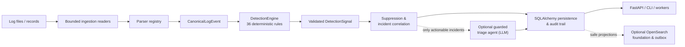

# Deterministic SOC Triage

[](https://github.com/beratkrmn7/Deterministic-SOC-Triage/actions/workflows/ci.yml)
[](https://www.python.org/downloads/)
[](https://github.com/astral-sh/ruff)
[](https://mypy-lang.org/)

**An evidence-first security operations triage platform where every security decision is deterministic, and the language model only rewrites — never decides.**

Deterministic SOC Triage ingests heterogeneous firewall and system logs, normalizes them
into a single canonical event model, evaluates **36 deterministic detection rules**,
correlates valid signals into incidents, and produces a concise, analyst-facing SOC brief.
An optional, tightly constrained LLM stage can improve the *wording* of the report — but it
cannot invent an incident, change a severity, touch an IP or port, or alter any piece of
evidence.

> [!IMPORTANT]
> This is an **analyst-support** tool, not an autonomous responder. It never blocks traffic
> or changes firewall policy, and an allowed connection is treated as *policy exposure* — it
> is never presented as proof of authentication, exploitation, or compromise.

---

## Table of contents

- [Why deterministic-first?](#why-deterministic-first)
- [Key features](#key-features)
- [Architecture](#architecture)
- [How it works](#how-it-works)
- [Detection coverage](#detection-coverage)
- [Quick start](#quick-start)
- [Configuration](#configuration)
- [Command-line usage](#command-line-usage)
- [REST API](#rest-api)
- [Background processing](#background-processing)
- [Security model](#security-model)
- [Development and quality gates](#development-and-quality-gates)
- [Repository layout](#repository-layout)
- [Documentation](#documentation)
- [Current boundaries](#current-boundaries)
- [License](#license)

---

## Why deterministic-first?

Most "AI SOC" tools put a language model in the decision path and hope it behaves. This
project inverts that. The trust boundary is explicit and enforced in code:

| | Deterministic core | Optional LLM stage |
| --- | --- | --- |
| **Decides incidents, severity, verdict** | ✅ Yes | ❌ Never |
| **Owns IPs, ports, counters, evidence IDs, ATT&CK** | ✅ Yes | ❌ Cannot modify |
| **Calls a provider during ingestion/detection** | ❌ Zero calls, ever | — |
| **Reaches the model** | — | Only *actionable* incidents, at most once each |
| **Effect of swapping / disabling the model** | None on any security field | Only report language changes |

Because detection is fully deterministic and the model runs at `temperature 0` with
schema-constrained JSON output, the same input yields the same security result — with or
without the LLM. Every model claim is checked against real evidence before a report is
accepted; if the model output is invalid or unreachable, a deterministic explanation is used
instead.

---

## Key features

- **Deterministic ingestion** — bounded streaming readers for JSON Lines, JSON arrays,
  single JSON objects, Syslog, CEF, and supported text logs. Malformed records are isolated
  and counted, never crash the file.
- **Canonical normalization** — stable `EVT-*` identifiers, timezone-aware timestamps, parse
  status, network/NAT/zone fields, PF SPI metadata, and structural TCP flags.
- **Contract-driven detection** — 36 immutable, deterministically registered rules covering
  network scanning, service probing, TCP/SPI anomalies, and inbound exposure/policy. Every
  emitted signal is validated for rule identity, evidence ownership, ordering, and duplicates.
- **Deterministic correlation** — stable signal/incident identities, bounded evidence,
  overlapping-window deduplication, optional cross-job campaign continuity, and transparent
  provenance.
- **Concise SOC output** — a provider-free brief with a triage funnel, prioritized
  actionable exposure, investigations, grouped blocked reconnaissance, suppressed findings,
  and an exposed-asset inventory. **Bilingual (English / Turkish) via `--lang`.**
- **Guarded, optional triage agent** — a LangGraph agent with Groq *or* local Ollama
  backends, bounded tools, evidence/claim validation, retries, circuit breaking, caching,
  and safe `needs_review` fallbacks.
- **Persistent application layer** — SQLAlchemy repositories, Unit-of-Work transactions,
  Alembic migrations, incident lifecycle state, audit trails, and idempotent analysis jobs.
- **REST & worker interfaces** — FastAPI endpoints, database-backed polling workers, and an
  optional Celery/Redis queue adapter.
- **Production-minded controls** — API-key or OIDC/JWT auth, RBAC, rate limiting,
  request-size limits, security headers, structured search, retention planning, verified
  archives, bounded cleanup, and an optional OpenSearch foundation.

---

## Architecture



The critical boundary sits between deterministic analysis and agentic review:

1. Readers and parsers produce validated canonical events.
2. `DetectionEngine` performs global eligibility and deduplication checks.
3. Each registered rule selects relevant events through its metadata contract.
4. Every emitted signal is checked against rule identity, input event IDs, evidence
   ownership, ordering, severity, and duplicate constraints.
5. Valid signals are correlated into deterministic incident bundles.
6. If enabled, the triage agent receives structured incident context and bounded tools; its
   evidence and claims are verified before a report is accepted.

For a completely provider-free path, use `python main.py --detect-file ...` or the
`/detect/file` endpoint.

---

## How it works

Every entry point — CLI, synchronous API, and background workers — shares one
`AnalysisService` flow, in a fixed order:

1. **Ingestion** — bounded readers load records safely from a file.
2. **Parsing & validation** — records are normalized into `CanonicalLogEvent`s; malformed or
   semantically invalid records are dropped and counted.
3. **Deterministic detection** — all valid events are evaluated by the 36 rules; every signal
   is contract-validated.
4. **Batch correlation** — valid signals are correlated into incident bundles.
5. **Optional cross-job correlation** — when `STATEFUL_CORRELATION_ENABLED=true`, incidents
   from the same campaign across adjacent files converge on one canonical incident. Absorbed
   duplicates are never persisted, reported, or projected. **Off by default.**
6. **Deterministic routing** — each unique incident is routed exactly once:
   `individual_triage`, `deterministic_report`, `digest`, or `store_only`.
7. **LLM only for actionable incidents** — only `individual_triage` incidents reach the
   provider, at most once each. The other three routes make **zero** provider calls.
8. **Concise SOC report** — `--report brief` (default) renders deterministic rollups;
   `--report full` preserves per-incident panels. Neither opens a second provider path.
9. **Persistence & output** — events, signals, incidents, reports, and audit events commit in
   one transaction with projections enqueued via a transactional outbox. Any failure rolls
   the whole job back.

**Guarantees worth stating explicitly:**

- Detection is fully deterministic.
- Ingestion and detection make **zero** LLM calls under any condition.
- Only individual-triage incidents reach the LLM — at most one call per unique incident.
- `deterministic_report`, `digest`, `store_only`, completed-job replay, and brief rendering
  make **zero** provider calls.
- No automated containment or firewall change is ever performed.

---

## Detection coverage

The default registry contains exactly **36 rules**, ordered by ascending priority then
`rule_id`. Re-running default registration is idempotent.

| Pack | Count | Registered rule IDs |
| --- | ---: | --- |
| Correctness & contract foundation | 5 | `network_scan_horizontal`, `network_scan_vertical`, `remote_service_probe`, `spi_anomaly_burst`, `network_flood_dos` |
| Advanced scan pack | 8 | `low_and_slow_horizontal_scan`, `low_and_slow_vertical_scan`, `repeated_blocked_scanner`, `internal_lateral_scan`, `subnet_sweep`, `distributed_scan`, `multi_service_sweep`, `scan_followed_by_allowed_connection` |
| Remote service probe pack | 8 | `smb_probe`, `vnc_probe`, `winrm_probe`, `database_service_probe`, `kubernetes_service_probe`, `docker_daemon_probe`, `web_admin_panel_probe`, `legacy_cleartext_service_probe` |
| TCP & SPI anomaly pack | 8 | `tcp_null_scan`, `tcp_xmas_scan`, `tcp_fin_scan`, `tcp_ack_scan`, `tcp_syn_fin_anomaly`, `tcp_syn_rst_anomaly`, `repeated_tcp_reset_anomaly`, `spi_followed_by_allowed_connection` |
| Inbound exposure & policy pack | 7 | `inbound_sensitive_service_allowed`, `critical_management_service_exposed`, `dnat_sensitive_service_exposure`, `wan_to_lan_sensitive_service_allowed`, `wan_to_dmz_administrative_service_allowed`, `blocked_then_allowed_same_service`, `multi_source_allowed_sensitive_service` |

Allowed inbound traffic is only ever treated as **policy/exposure evidence**, never as proof
of compromise. Fully blocked reconnaissance is severity-capped and grouped separately from
actionable exposure. See [Detection Engine](docs/detection_engine.md) for rule contracts,
thresholds, service sets, and how to add a rule.

---

## Quick start

### Requirements

- Python 3.11+
- Git
- *(optional)* A Groq API key — only for Groq-backed triage
- *(optional)* Ollama — only for local LLM triage
- *(optional)* Redis — only for Celery or the Redis rate-limit backend
- *(optional)* OpenSearch — only when its foundation is explicitly enabled

### Install (Windows PowerShell)

```powershell
git clone https://github.com/beratkrmn7/Deterministic-SOC-Triage.git
Set-Location Deterministic-SOC-Triage

py -3.11 -m venv .venv
.\.venv\Scripts\Activate.ps1
python -m pip install --upgrade pip
python -m pip install -r requirements-dev.txt

Copy-Item .env.example .env
python -m alembic upgrade head
```

### Install (Linux / macOS)

```bash
git clone https://github.com/beratkrmn7/Deterministic-SOC-Triage.git
cd Deterministic-SOC-Triage

python3.11 -m venv .venv
source .venv/bin/activate
python -m pip install --upgrade pip
python -m pip install -r requirements-dev.txt

cp .env.example .env
python -m alembic upgrade head
```

SQLite is the default database (`sqlite:///soc_triage.db`). Run the Alembic upgrade before
using the persistent API or background workers.

### Run it in 30 seconds (no provider needed)

```bash
# Deterministic detection only — zero LLM calls
python main.py --detect-file data/samples/sanitized_firewall_sample.jsonl
```

---

## Configuration

Settings load from environment variables and `.env` via Pydantic Settings. Start from
[.env.example](.env.example), which documents every security, triage, rate-limit, search,
retention, and OpenSearch option.

| Setting | Default | Purpose |
| --- | --- | --- |
| `LLM_ENABLED` | `true` | Enables the optional triage stage; pure detection mode is unaffected. |
| `LLM_PROVIDER` | `groq` | `groq` or `ollama`. |
| `LLM_MODEL` | `openai/gpt-oss-120b` | Model identifier for the selected provider. |
| `GROQ_API_KEY` | empty | Required only for Groq-backed triage. |
| `OLLAMA_BASE_URL` | `http://127.0.0.1:11434` | Local Ollama endpoint. |
| `DATABASE_URL` | `sqlite:///soc_triage.db` | SQLAlchemy connection string. |
| `AUTH_MODE` | `disabled` | Local bypass, `api_key`, `oidc`, or `hybrid`. |
| `TASK_QUEUE_BACKEND` | `database` | Database polling or `celery`. |
| `RATE_LIMIT_BACKEND` | `memory` | Dev memory limiter or production Redis limiter. |
| `OPENSEARCH_ENABLED` | `false` | Enables explicit OpenSearch maintenance operations. |
| `STATEFUL_CORRELATION_ENABLED` | `false` | Optional persistent cross-job correlation. Off by default; when off, incident IDs and provider-call counts match the batch-local path exactly. |

For a fully local, provider-free configuration:

```dotenv
LLM_ENABLED=false
LLM_PARSER_FALLBACK_ENABLED=false
```

Production configuration is intentionally fail-closed: replace all example secrets, enable
HTTPS, configure trusted hosts/proxies, use durable shared rate limiting, and select an
authenticated `AUTH_MODE` before exposing the API.

---

## Command-line usage

```bash
# 1) Ingestion only — prints format, parser, duration, success/failure counts
python main.py --ingest-file data/samples/sanitized_firewall_sample.jsonl

# 2) Deterministic detection only — 36 rules, suppression, correlation, no provider
python main.py --detect-file data/samples/sanitized_firewall_sample.jsonl

# 3) End-to-end analysis with the concise SOC brief (default)
python main.py --file data/samples/sanitized_firewall_sample.jsonl --report brief

# 4) Turkish output
python main.py --file data/samples/sanitized_firewall_sample.jsonl --report brief --lang tr

# 5) Detailed per-incident panels
python main.py --file data/samples/sanitized_firewall_sample.jsonl --report full

# 6) Prevent merging with previously persisted campaigns
python main.py --file data/samples/sanitized_firewall_sample.jsonl --isolated
```

| Flag | Values | Notes |
| --- | --- | --- |
| `--report` | `brief` (default), `full` | Presentation only — never changes the analysis key. |
| `--lang` | `en` (default), `tr` | Bilingual output from the same single provider call. |
| `--isolated` | flag | Part of the idempotency scope; disables cross-job correlation for this run. |

With no argument, `main.py` runs the bundled mock-incident demo. Set `RUN_ALL=true` to
process every mock item.

---

## REST API

```bash
python -m uvicorn server:app --host 127.0.0.1 --port 8000 --reload
```

Interactive docs are served at <http://127.0.0.1:8000/docs> when `API_DOCS_ENABLED=true`.

Useful endpoint groups:

- `GET /health/live`, `GET /health/ready`
- `POST /ingest/file`, `POST /detect/file`, `POST /analyze/file`
- `POST /api/v1/analysis-jobs/file`, `GET /api/v1/analysis-jobs/{job_id}` and `/result`
- `GET /api/v1/incidents/` plus incident detail, evidence, signal, event, report, timeline
- `GET /api/v1/search/incidents`, `/events`, `/signals`, `/jobs`
- `GET /api/v1/workers`

Provider-free detection request:

```bash
curl -X POST \
  -F "file=@data/samples/sanitized_firewall_sample.jsonl" \
  http://127.0.0.1:8000/detect/file
```

Versioned APIs enforce the configured authentication, RBAC permissions, and rate limits.
Legacy synchronous endpoints remain available for compatibility.

---

## Background processing

The default queue backend stores job state in the database. Start a polling worker:

```bash
python -m agent.workers.analysis_worker           # long-running
python -m agent.workers.analysis_worker --once     # process at most one job
python -m agent.workers.analysis_worker --recover-stale
```

For Celery transport, set `TASK_QUEUE_BACKEND=celery` with a Redis broker, then:

```bash
python -m celery -A agent.queue.celery_app worker --loglevel=info -Q soc-analysis
```

The database stays the source of truth; Redis only transports job identifiers. The API and
worker must share `DATABASE_URL` and `STAGING_DIR`. See
[Celery and Redis Queue Adapter](docs/phase5b2-celery-redis.md).

---

## Security model

- Raw records never reach detection rules as unvalidated dictionaries.
- File and request sizes are bounded; temporary files are cleaned up safely.
- Errors, warnings, and logs use bounded identifiers — never raw event contents, tokens,
  credentials, or tracebacks.
- API-key auth stores hashed credentials; OIDC mode validates externally issued asymmetric
  JWTs through bounded discovery/JWKS caches.
- RBAC separates viewer, analyst, service, and admin permissions.
- Deployment middleware controls trusted hosts, proxy headers, HTTPS enforcement, CORS,
  security headers, and docs exposure.
- LLM output is schema-constrained and cannot become a final report until its evidence and
  claims pass deterministic validation.

> Never commit `.env`, real API keys, tokens, tenant details, private keys, or production
> connection strings.

---

## Development and quality gates

Install `requirements-dev.txt`, then run the same core checks as CI:

```bash
python -m compileall agent main.py server.py
ruff check .
mypy agent main.py server.py
python -m pytest -q --cov=agent --cov-report=term-missing
```

The test suite is extensive (**1,300+ tests** across parser, detection, correlation, triage,
API security, persistence, archive/retention/cleanup, OpenSearch outbox, and worker
lifecycle). Target a subsystem while developing:

```bash
pytest -q tests/detection
pytest -q tests/ingestion
pytest -q tests/api_security
```

Detection tests use fixed timezone-aware timestamps, documentation IP ranges, shared event
builders, contract assertions, provider-call guards, and deterministic identity checks. New
rules should ship positive, negative, threshold-boundary, evidence-ownership, and
repeatability tests.

---

## Repository layout

```text
agent/
  api/             FastAPI health, security, incident, job, search, worker routes
  application/     Analysis, background-job, auth, search, archive, cleanup services
  archive/         Safe archive formats, storage, integrity, serialization
  detection/       Rule contracts, registry, engine, rules, evidence, suppression
  ingestion/       Format detection, bounded readers, limits, validation, pipeline
  maintenance/     Retention, archive, cleanup, OpenSearch commands
  opensearch/      Safe documents, mappings, client, foundation management
  parsers/         PF, CEF, Syslog, generic JSON, and mock parsers
  persistence/     SQLAlchemy models, repositories, mappers, Unit of Work
  queue/           Database and Celery dispatch adapters
  security/        API keys, OIDC/JWT, RBAC, rate limiting, deployment controls
  triage/          Providers, bounded tools, guardrails, validation, reporting
  workers/         Polling analysis worker and heartbeat service
alembic/           Database migrations
data/samples/      Sanitized sample inputs
docs/              Architecture, operations, security, and rule documentation
scripts/           Demonstrations and benchmarks
tests/             Unit, regression, integration, and security tests
main.py            CLI entry point
server.py          FastAPI application entry point
```

---

## Documentation

Start with the [Detection Engine](docs/detection_engine.md) and
[Real-log triage behavior](docs/real-log-triage.md). The [docs](docs) directory also covers
rule tuning, false-positive handling, adding a parser, secure agentic triage, the persistent
backend, background jobs, Celery/Redis, API-key/OIDC auth, RBAC, the API security baseline,
rate limiting, structured search, retention planning, safe archives, bounded cleanup, and the
OpenSearch foundation.

---

## Current boundaries

This repository is an engineering foundation and SOC-triage proof of concept — not a complete
SIEM or autonomous-response platform.

- Rule evaluation is batch-local to one `DetectionEngine.analyze(...)` call. Optional
  persistence correlates already-built incidents across jobs; it gives rules no hidden state.
- There is no streaming baseline, GeoIP, or threat-intelligence lookup.
- Allowed firewall traffic is exposure/policy evidence — not proof of authentication,
  exploitation, or compromise.
- Incident Correlation V2 is deterministic and implemented; it does **not** include fuzzy
  source-only grouping. Automated remediation and a UI are not implemented.
- OpenSearch bootstrap and transactional-outbox foundations exist, but no outbox delivery
  worker is included yet.
- Local archives are integrity-protected but not encrypted; production storage and key
  management remain deployment responsibilities.

These boundaries are deliberate: deterministic evidence, traceability, safe failure, and
backward compatibility take priority over unsupported security conclusions.

---

## License

No license file is currently included, so default copyright applies (all rights reserved by
the author). Add a `LICENSE` file to grant reuse rights if you intend this project to be used
or distributed by others.
