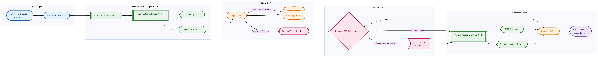

# Agentic SOC Triage Assistant

A LangGraph-based Agentic SOC Triage Assistant PoC that combines deterministic detection rules, constrained LLM-based triage, evidence validation, and concise SOC reporting.

Bu proje, güvenlik loglarını analiz ederek SOC analistleri için kanıta dayalı triage kararı ve kısa olay raporu üreten agentic bir SOC triage PoC sistemidir.

## System Overview

This project is not a simple LLM chatbot. Raw logs are first normalized and analyzed by deterministic Python detection rules. These rules generate detected signals and candidate evidence before the LLM is invoked. The Triage Agent then reviews these signals, optionally calls the `search_logs` tool for additional context, and submits a structured triage decision. Every evidence item is validated against the original raw logs before the final report is generated.

The final output is a concise SOC triage report focused on four questions:

1. What happened?
2. Why is it suspicious or benign?
3. What evidence supports the verdict?
4. What should the analyst do next?

## Architecture

The workflow is implemented as a controlled LangGraph state machine. Deterministic nodes handle extraction, detection, validation, MITRE mapping, and action recommendation. The LLM is constrained to the triage and reporting stages, reducing hallucination risk and keeping decisions evidence-based.



The key idea is that the LLM does not directly decide from raw logs alone. It receives deterministic signals and candidate evidence, and its output is validated before reporting.

## Key Features

- **LangGraph-based agentic workflow:** The system is built as a controlled state machine instead of a free-form chatbot.
- **Deterministic pre-analysis:** Python detection rules identify suspicious or benign patterns before the LLM is invoked.
- **Candidate evidence generation:** Detection rules generate structured evidence with `event_id`, `quote`, `reason`, and `source`.
- **Constrained Triage Agent:** The LLM can only use limited tools such as `search_logs` and `submit_triage_result`.
- **Evidence validation:** Every submitted evidence item is checked against the original raw logs.
- **needs_review fallback:** Invalid, missing, or weak evidence prevents unsafe automatic decisions.
- **MITRE ATT&CK mapping:** Relevant incident types are mapped to ATT&CK techniques.
- **Concise SOC reporting:** Reports are short, evidence-based, and focused on analyst decision-making.
- **FastAPI support:** The workflow can be used through REST endpoints.
- **Pytest coverage:** Deterministic detection and validation logic are covered by tests.

## Why This Is Not Just an LLM Chatbot

A simple chatbot would send raw logs directly to an LLM and return a free-form answer. This project uses a controlled agentic workflow:

1. Logs are normalized with event IDs.
2. Deterministic detection rules generate signals and candidate evidence.
3. The Triage Agent reviews structured evidence and may call tools for more context.
4. The triage result must follow a strict Pydantic schema.
5. Evidence is validated against the original raw logs.
6. The final report is generated only from validated evidence and deterministic recommendations.

This makes the system a controlled Agentic SOC Triage PoC rather than a plain LLM chatbot.

## Report Generation

The report generation layer is intentionally concise and evidence-first. The goal is not to produce long generic security writeups, but to create a short SOC triage report that can be understood quickly.

Each report answers four questions:

1. **Verdict:** Is the incident a false positive, suspicious activity, confirmed incident, or does it need human review?
2. **Why it matters:** Why is the log suspicious, malicious, benign, or inconclusive?
3. **Key evidence:** Which validated event IDs and log quotes support the decision?
4. **Recommended actions:** What should the analyst do next?

The report is designed to be short and readable. It avoids unsupported claims such as data exfiltration, account compromise, or database compromise unless the logs provide direct evidence.

### Example Report Format

```text
## Triage Summary
- Verdict: suspicious
- Incident Type: bruteforce_failed
- Severity: medium
- Confidence: 0.86

## Why It Matters
Multiple failed SSH login attempts were observed from the same source IP within a short time window. No successful login was found, so the activity is classified as suspicious rather than confirmed compromise.

## Key Evidence
- INC-002-E001: Failed password for root from 203.0.113.42 port 38412 ssh2
- INC-002-E002: Failed password for admin from 203.0.113.42 port 38414 ssh2
- INC-002-E003: Failed password for test from 203.0.113.42 port 38416 ssh2

## Recommended Actions
- Review additional authentication logs for the same source IP.
- Check whether other hosts were targeted.
- Consider temporary IP blocking if attempts continue.
```

## Tech Stack

- Python 3.10+
- LangGraph
- LangChain / LangChain Groq
- Groq API with Llama 3.3 70B
- Pydantic
- FastAPI
- Uvicorn
- Pytest
- Rich for terminal output

## Project Structure

```text
SOC-Project/
├── agent/
│   ├── graph.py          # LangGraph workflow definition
│   ├── nodes.py          # Workflow nodes: extraction, detection, triage, validation, reporting
│   ├── tools.py          # LLM-accessible tools and deterministic detection functions
│   └── models.py         # Pydantic schemas and LangGraph state definitions
├── data/
│   └── mock_logs.json    # Mock SOC incident dataset
├── tests/
│   ├── test_detection_tools.py
│   ├── test_evidence_validation.py
│   ├── test_reporter_output.py
│   └── test_graph_smoke.py
├── main.py               # Terminal-based test runner
├── server.py             # FastAPI server
├── requirements.txt
└── README.md
```

## Getting Started

### 1. Install dependencies

```bash
pip install -r requirements.txt
```

### 2. Configure environment variables

Create a `.env` file:

```env
GROQ_API_KEY=your_groq_api_key_here
```

Do not commit `.env` to GitHub.

### 3. Run terminal demo

```bash
python main.py
```

Run all mock incidents:

```bash
RUN_ALL=true python main.py
```

### 4. Run API server

```bash
python server.py
```

Open Swagger UI:

```text
http://localhost:8000/docs
```

### 5. Run tests

```bash
pytest
```

## API Endpoints

### Health check

```http
GET /health
```

### Analyze incident

```http
POST /analyze
```

Example request:

```json
{
  "incident_id": "INC-001",
  "raw_logs": [
    {
      "timestamp": "2023-10-27T10:15:00Z",
      "src_ip": "192.168.1.100",
      "dst_ip": "10.0.0.5",
      "event_type": "HTTP_GET",
      "raw_message": "GET /index.html HTTP/1.1 200 OK"
    }
  ]
}
```

### Get report

```http
GET /incident/{incident_id}/report
```

## Mock Dataset

The project includes mock SOC incidents covering both suspicious activity and false positives:

- Standard benign web traffic
- Failed SSH brute force attempt
- SQL injection attempt
- Normal admin login false positive
- Port scan activity
- Brute force followed by successful login
- XSS payload attempt
- Suspicious PowerShell command
- Malware hash alert
- DNS tunneling pattern
- Lateral movement via SMB/PsExec
- Internal backup traffic false positive

## Limitations

This project is a PoC and is not intended to replace a production SIEM, SOAR, or SOC platform.

Current limitations:

- Uses mock log data instead of a real SIEM backend.
- Detection rules are simplified for demonstration.
- Threat intelligence integrations are not included yet.
- The LLM is used for triage synthesis, so output is constrained and validated.
- In-memory API storage is used instead of a persistent database.

## Future Work

Possible improvements:

- Elasticsearch or OpenSearch integration
- VirusTotal / AbuseIPDB threat intelligence lookup
- Persistent incident database
- Web dashboard for analysts
- More MITRE ATT&CK mappings
- Human-in-the-loop approval workflow
- Docker deployment
- More realistic log normalization pipeline

## Security Note

Never commit `.env` files or API keys. Use `.env.example` for documentation and keep real credentials local.
